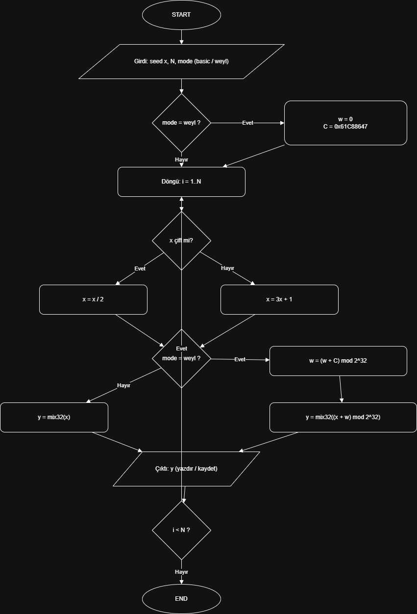

# Collatz RNG (x/2, 3x+1) — Pseudo Random Number Generator

Bu repo, Collatz dönüşümünü (çiftse x/2, tekse 3x+1) kullanarak pseudo-random sayı üreten iki sürüm içerir:

- **V0 (basic):** Collatz + `mix32`
- **V1 (weyl):** Collatz + Weyl sayaç + `mix32` (döngü etkisini azaltır)

> Not: Bu çalışma kriptografik güvenli RNG iddiası taşımaz. Ödev/demonstrasyon amaçlıdır.

## Proje yapısı

- `src/collatz_rng.py` → RNG ve anahtar üretimi
- `docs/pseudocode.md` → sözde kod
- `docs/flowchart.png` → akış şeması görseli
- `examples/sample_output.txt` → örnek çıktılar

## Algoritma özeti

**Collatz adımı**
- x çift → x = x/2
- x tek  → x = 3x + 1

**Çıktı üretimi**
- x değeri doğrudan verilmez, `mix32(x)` ile karıştırılır.

**V1 (weyl) farkı**
- Her adımda `w = (w + C) mod 2^32` güncellenir (`C = 0x61C88647`)
- Çıktı `mix32(x + w)` alınır.

## Kullanım

### 10 adet 32-bit çıktı (hex)
```bash
python src/collatz_rng.py --seed 2025 --n 10 --mode basic --hex
python src/collatz_rng.py --seed 2025 --n 10 --mode weyl  --hex


Sınırlamalar

Collatz dizisi birçok seed için kısa sürede 1-4-2-1 döngüsüne iner; bu yüzden basic sürüm uzun vadede periyodik davranış gösterebilir.

Bu yüzden V1’de Weyl sayaç + mixing kullanılır.

## Akış şeması



